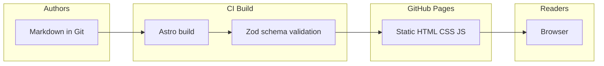

# Architecture — juanmaperez portfolio migration

**Author:** Juanma  
**Date:** 2026-04-20  
**Inputs:** PRD v1.1, technical research, brownfield `docs/`  
**Status:** Complete (single-pass **[CA]** synthesis for implementation agents)

---

## 1. Purpose and scope

This document is the **technical single source of truth** for replatforming the personal site from **Gatsby 2** to **Astro** with **static output**, **GitHub Pages** deployment, and **PRD v1.1** compliance (including migration parity checklist, baselines, FR16–FR21, NFR-P1–P2).

**In scope:** Routing parity, content collections, build/deploy, SEO/redirects, image pipeline, client-island policy, performance baseline procedure.  
**Out of scope:** Product redesign, headless CMS, SSR product features (post-MVP per PRD).

---

## 2. Context summary

| Source | Implication |
|--------|-------------|
| **PRD** | Static-first MPA; mandatory content schema validation before cutover; LCP/JS baselines; contact + internal link requirements. |
| **Brownfield `docs/`** | Current routes from `gatsby-node.js`; Markdown under `src/content/posts` and `projects`; build-time GraphQL only. |
| **Research** | Astro + content collections + GitHub Actions deploy; islands for selective hydration. |

---

## 3. Architecture decision records (ADRs)

### ADR-001 — Static site generator: **Astro**

- **Decision:** Use **Astro** (current LTS major per `npm create astro@latest` at implementation time) with `output: 'static'`.  
- **Rationale:** Aligns with PRD/research: HTML-first, Markdown/MDX, content collections, optional React islands, official Gatsby migration guide, GitHub Pages documentation.  
- **Consequences:** New repo layout; team learns `.astro` and content config; GraphQL eliminated.

### ADR-002 — Hosting: **GitHub Pages** + **GitHub Actions**

- **Decision:** Deploy static assets via **official Astro deploy workflow** (`withastro/action` + `actions/deploy-pages` or equivalent maintained pattern).  
- **Rationale:** PRD assumption; matches existing `gh-pages` mental model; reproducible CI.  
- **Consequences:** Correct `site` and `base` in `astro.config.mjs`; custom domain remains a GitHub/DNS concern.

### ADR-003 — Content: **Astro Content Collections** with **Zod** schemas

- **Decision:** Two collections — `posts` and `projects` — with Zod schemas mirroring `docs/data-models.md` fields; **build fails** on schema violation (PRD **FR17**).  
- **Rationale:** Typed content replaces GraphQL shape enforcement.  
- **Consequences:** `src/content.config.ts` (or project-default path per Astro version); authors must satisfy schema.

### ADR-004 — Client JS: **islands only when checklist-approved**

- **Decision:** Default pages ship **no React runtime**. Use `@astrojs/react` (or similar) only on routes/components listed in **migration parity checklist** with owner sign-off (PRD **FR19**, **NFR-P2**).  
- **Rationale:** Legacy GSAP/ScrollMagic; SSR pitfalls in Gatsby `gatsby-node` null-loader pattern → move to **client-only** boundaries in Astro.  
- **Consequences:** Explicit `client:visible` / `client:load` choices documented per component.

### ADR-005 — Styling: **scoped `.astro` + ported global CSS + optional Sass**

- **Decision:** Phase 1: migrate **critical global styles** (`main.css`, mixins) into `src/styles/` and component-scoped CSS; avoid `styled-components` unless trapped inside an approved React island.  
- **Rationale:** Remove runtime CSS-in-JS from default path; reduce bundle.  
- **Consequences:** Visual diff per template during migration.

### ADR-006 — Images: **`astro:assets`** (or documented Astro image pipeline)

- **Decision:** Use Astro’s documented image integration for responsive images; co-locate or map assets from `src/assets/` mirroring current `gatsby-source-filesystem` roots.  
- **Rationale:** Replaces `gatsby-image` / `childImageSharp` fluid paths.  
- **Consequences:** Rework image references in Markdown (or use remark/rehype patterns per Astro docs).

### ADR-007 — Analytics: **GA4 (gtag) or privacy-first alternative**

- **Decision:** Replace Universal Analytics plugin with **one** documented snippet (e.g. GA4) injected in base layout with **async/defer** (PRD **NFR-S2**).  
- **Rationale:** UA sunset; PRD technical success.  
- **Consequences:** Measurement ID via env at build time if needed: `PUBLIC_GA_ID`.

---

## 4. Logical view (C4-lite)



No application server in MVP. Third-party: analytics host only.

---

## 5. Routing and URL parity

### 5.1 Static file routes (file-based)

| URL | Astro implementation (pattern) |
|-----|----------------------------------|
| `/` | `src/pages/index.astro` |
| `/cv/` | `src/pages/cv.astro` or `src/pages/cv/index.astro` |
| `/404` | `src/pages/404.astro` |

### 5.2 Dynamic segments (build-time `getStaticPaths`)

| Pattern | Source | Notes |
|---------|--------|--------|
| `/blog/` | Paginate collection `posts` | Match legacy: page 1 at `/blog/`, others `/blog/page/N/` (trailing slash policy: pick one and redirect—document in checklist). |
| `/blog/page/[n]/` | Same | `postsPerPage = 12` per legacy `gatsby-node.js`. |
| `/blog/category/[category]/` | Distinct `category` from posts | One page per category value. |
| `[...slug]` for posts | `posts` collection `path` field | Legacy `frontmatter.path` like `/blog/how-javascript-engine-works` — use `path` as canonical URL key in `getStaticPaths`. |
| Project routes | `projects` collection `path` | e.g. `/projects/umaicha`. |

### 5.3 Redirects

- Implement via `astro.config` `redirects` map **or** host-level (GitHub Pages `_redirects` not native—prefer **astro redirects** static export compatibility per Astro version docs).  
- Every intentional URL change: row in **parity checklist** + redirect entry + SEO validation.

---

## 6. Content model (collections)

**Config file:** `src/content.config.ts` (adjust if Astro version uses different entry; follow official docs).

### 6.1 Collection: `posts`

| Field | Type | Required | Notes |
|-------|------|----------|--------|
| `path` | string | yes | Leading slash; unique; used as canonical URL. |
| `title` | string | yes | |
| `date` | date or string | yes | Parse consistently; sort DESC for lists. |
| `type` | literal `post` | yes | Discriminator. |
| `category` | string | yes | Drives category index. |
| `tags` | array(string) | yes | Allow empty array if legacy missing—prefer require and fix content. |
| `excerpt` | string | yes | |
| `icon` | string (path) | optional | Map to image import or public path. |
| `thumbnail` | string (path) | optional | List views. |

Body: Markdown; code highlighting via **Shiki** (recommended) or `@astrojs/mdx` + highlighter—decide in implementation; satisfies **FR14**.

### 6.2 Collection: `projects`

| Field | Type | Required | Notes |
|-------|------|----------|--------|
| `path` | string | yes | |
| `title` | string | yes | |
| `date` | date or string | yes | |
| `type` | literal `projects` | yes | |
| `category` | string | yes | Often `projects`. |
| `thumbnail` | string | yes | Case study hero. |
| `images` | array `{ title, image }` | optional | Normalize to schema Zod allows. |
| `excerpt` | string | yes | |

### 6.3 Content locations

- **Physical paths:** `src/content/posts/**` and `src/content/projects/**` (mirror current repo to minimize git churn) **or** single flat `src/content/post/*.md`—pick one structure and update `loader` globs accordingly.  
- **Migration:** Copy existing markdown; normalize frontmatter against schema; fix paths to images.

---

## 7. Gatsby GraphQL → Astro mapping (agent reference)

| Gatsby usage | Astro replacement |
|--------------|---------------------|
| `allMarkdownRemark` filters (`type: post` / `projects`) | `getCollection('posts' \| 'projects')` with optional `filter` in page |
| `createPage` blog list + context `limit/skip` | `getStaticPaths` + slice paginated array |
| `createPage` per post/project path | `getStaticPaths` returning `params` derived from `path` |
| `StaticQuery` / `useStaticQuery` in layouts | Import site config from `src/site.config.ts` or JSON |
| `gatsby-plugin-react-helmet` | `<head>` in layouts + SEO component |
| `gatsby-image` / `childImageSharp` | `<Image />` / `getImage` patterns per `astro:assets` docs |
| `gatsby-remark-images` | Astro markdown + asset pipeline or MDX |
| `gatsby-remark-prismjs` | Shiki / rehype |

Source of field usage: `docs/api-contracts.md` and `gatsby-node.js` (repo).

---

## 8. Islands and legacy animation

1. **Inventory** each template using GSAP, ScrollMagic, `react-spring`, etc. (from `src/`).  
2. For each, choose: **static HTML/CSS only**, **vanilla `<script>`** in Astro, or **React island** with `client:visible` / `client:media`.  
3. **No** ScrollMagic during prerender: keep **client-only** execution (parity with legacy `build-html` null-loader intent).  
4. Record decision in **migration parity checklist** (section 12).

---

## 9. Project structure (target)

```
repo-root/
├── .github/workflows/deploy.yml    # Astro → GitHub Pages
├── astro.config.mjs
├── package.json
├── tsconfig.json
├── public/                          # static assets not processed
├── src/
│   ├── content.config.ts            # collections + Zod
│   ├── content/
│   │   ├── posts/                   # migrated post folders
│   │   └── projects/                # migrated project folders
│   ├── layouts/
│   │   ├── BaseLayout.astro         # html shell, SEO slot
│   │   └── BlogLayout.astro
│   ├── components/
│   │   ├── seo/
│   │   ├── nav/
│   │   ├── blog/
│   │   ├── home/
│   │   └── cv/
│   ├── pages/
│   │   ├── index.astro
│   │   ├── cv.astro
│   │   ├── 404.astro
│   │   ├── blog/
│   │   │   ├── index.astro          # page 1
│   │   │   └── page/[page].astro
│   │   ├── blog/category/[category].astro
│   │   └── ...                      # dynamic post layout under chosen pattern
│   ├── styles/
│   ├── site.config.ts               # title, description, url, nav
│   └── assets/                      # images, fonts (mirrors legacy)
├── _baseline/                       # optional: committed Lighthouse JSON (git-lfs if large)
└── docs/
    └── migration-parity-checklist.md
```

Adjust `pages` nesting to match Astro’s `getStaticPaths` file routing convention for the chosen Astro major.

---

## 10. SEO and metadata

- **Global defaults** in `BaseLayout.astro` from `site.config.ts` (site title, description, `site` URL for OG absolute URLs).  
- **Per-page** title/description from collection entry frontmatter.  
- **`@astrojs/sitemap`** with `site` set to production URL (`https://juanmaperez.dev` or as configured).  
- **Canonical** and **OG** tags: component pattern; validate with PRD **FR10–FR11**.

---

## 11. CI/CD — GitHub Actions

1. **Trigger:** push to `main` (or `master` per repo default).  
2. **Jobs:** checkout → setup Node (LTS version pinned in `.nvmrc` or `package.json` engines) → `npm ci` → `npm run build` → upload Pages artifact.  
3. **Secrets:** none for public GA ID if using `PUBLIC_*` build args; avoid committing secrets (**NFR-S1**).  
4. **Concurrency:** `concurrency: group: pages` to avoid overlapping deploys.

Reference: [Deploy your Astro Site to GitHub Pages](https://docs.astro.build/en/guides/deploy/github).

---

## 12. Migration parity checklist (template)

Maintain `docs/migration-parity-checklist.md` (or path in `inputDocuments` once created). **Each row = one legacy URL or template class.**

| Route / template | Legacy path | Motion parity (same / simplified / removed) | Islands approved (Y/N, names) | LCP/JS exception (Y/N) | Sign-off | Notes |
|------------------|-------------|--------------------------------------------|-------------------------------|--------------------------|----------|-------|
| Home | `/` | | | | | |
| CV | `/cv/` | | | | | |
| Blog list p1 | `/blog/` | | | | | |
| Example post | `/blog/...` | | | | | |
| Example project | `/projects/...` | | | | | |

**FR19** approval: product owner checks “motion parity” and narrative columns before cutover.

---

## 13. Performance baseline procedure (NFR-P1, NFR-P2)

1. **Freeze URLs:** record production (or staging) URLs for **`/`** and **one representative blog post** (same as PRD table).  
2. **Tool:** Lighthouse CLI **or** Chrome DevTools Lighthouse; record **preset** (e.g. mobile), **throttling**, **Chrome version**.  
3. **Artifacts:** save JSON/HTML under `_baseline/` or CI artifact with **git SHA** and **date** in filename.  
4. **Metrics:** LCP, Performance score (optional but PRD mentions score for home), **total transferred JS** for navigation.  
5. **Post-migration:** rerun identical method; fail release if regression beyond PRD thresholds unless checklist-approved exception exists.

---

## 14. Functional requirements traceability (summary)

| FR | Architecture anchor |
|----|---------------------|
| FR1–FR7 | Sections 5, 9, 10 |
| FR8–FR9 | Section 6 |
| FR10–FR12 | Section 10 + redirects (5.3) |
| FR13–FR15 | Sections 6, 9, ADR-006 |
| FR16 | ADR-001 + dev command in README |
| FR17 | ADR-003 |
| FR18 | Section 11 |
| FR19 | Sections 8, 12 |
| FR20 | `site.config.ts` nav + home template |
| FR21 | CI step: `npx astro check` + link checker script (optional `lychee` or similar) on `dist/` |

---

## 15. Open decisions (resolve during implementation)

1. **Trailing slashes:** match legacy behavior exactly vs Astro defaults—document choice.  
2. **MDX vs Markdown-only** for posts with embedded components—default Markdown; upgrade selective files.  
3. **Repo strategy:** new branch replacing `src` vs new repo—operational, not architectural blocker.  
4. **Exact Node version:** set `engines` + `.nvmrc` to the version that works with chosen Astro major.

---

## 16. Handoff — next BMad steps

1. **`[CE] Create Epics and Stories`** — decompose FRs into stories (parity checklist rows, collection setup, CI, per-template migration).  
2. **`[IR] Check Implementation Readiness`** after epics drafted.  
3. **`bmad-dev-story`** — execute implementation per sprint.

---

_Architecture workflow steps 1–8 synthesized in one document for Agent mode implementation._
