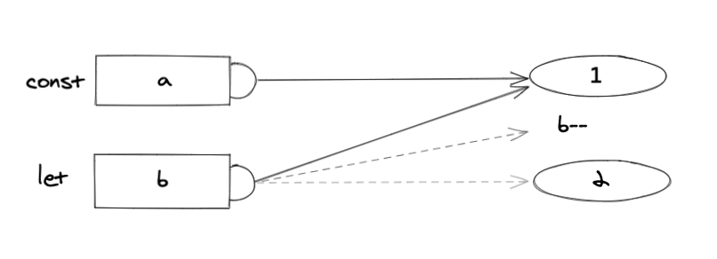

In the universe of Javascript, there are many different values, but only some of them are primitives values.

Primitives values are unique values existing in the Javascript universe awaiting to be used by our code, maybe being assigned to a variable or as a result of an expression.

```js
	const open = true

	2 + 2
``` 

There are quite a few primitive values such as strings, booleans, numbers, bigInts, symbols, null, and undefined, all of them different, uniques, and ready to be used.

That’s the main difference between primitive values and other values like objects and functions. Primitives values are already there, really close to our code awaiting to be used.

For example, every time we assign a variable to a boolean, we are completely sure that this value will never change, we can assign another value to that variable but we can’t manipulate the original value.

Let’s have a look at the next example:

```js
	const a = 1
	let b = 2
	
	b--
```


## We could read this snippet saying:
 
1. Assign the value 1 to the variable a
2. Assign the value 2 to the variable b
3. ??

And what’s going on in the third step is the really interesting bit because a lot of people would disagree on how to speak out this line of code, and It’s important to not use the wrong to describe it.

Some people would say that we are decreasing the value of b, but what we are really doing is executing an expression that subtracts one unit to b, and points the variable b to the new brand value returned from that expression. 




That’s what It means immutability linked to primitive values, there is nothing we could do to modify a primitive value assigned to a variable, instead what we can do it’s to point our variable to a different value resulting from an expression or from a direct assignment.

Primitive values compared to objects

Some objects like arrays can have similarities with a primitive value like strings. In the same way, we can access an item in the array through the index, we can do the same with strings. That’s because arrays are a sequence of values and strings are sequences of characters but that doesn’t mean that strings are objects.

```js
	let arr = [“w”, “o”, “m”, “a”, “n”]
	let str = “woman”

	console.log(arr[0]) 	// w 
	console.log(str[0]]) 	// w 
```

But because strings are primitives we can’t change them in the same way we could change a value in our array. We could change the index [3] item in the array by an “e”, but not in our string, and that’s because of the concept of immutability

```js
	arr[3] = “e” 	//  [“w”, “o”, “m”, “e”, “n”]
	str[3] = “e”  	// not allowed 
```

The only we can do it’s changing our pointer from the unique value “woman”, to the unique value “women”, and that’s only changing the value on which our variable will evaluate when it’s read.

```js
	let str = “woman”
	str = “women”
```

## Wrapping up

As we can see we have different types of values. Some are more manipulable than others. In these terms, we can say that the group of primitive values, are all the values that are immutable and there is nothing we can do to change them. 
